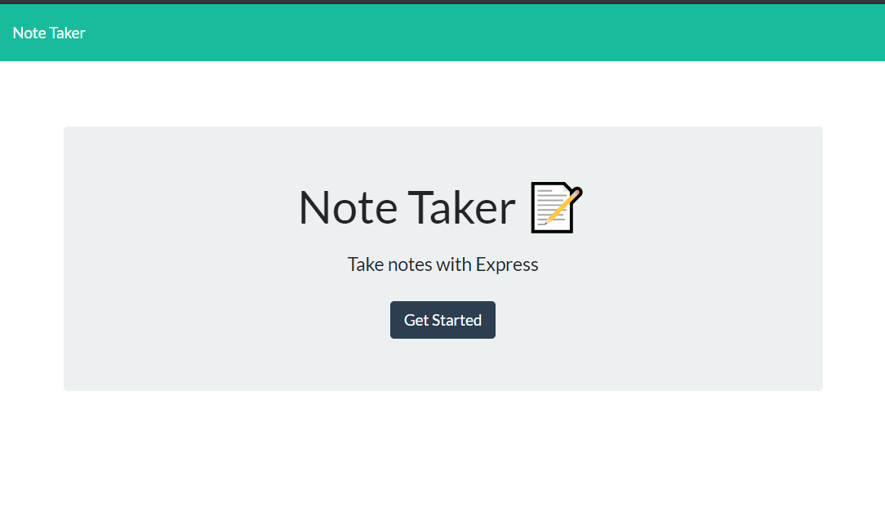
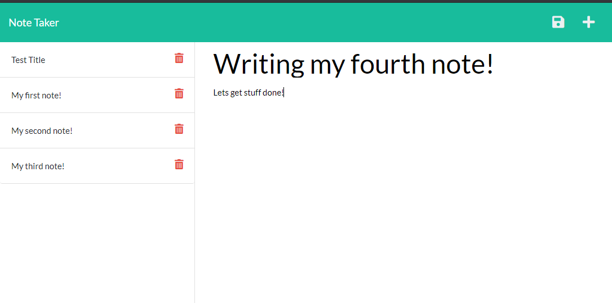

# Note-Taker
## About the Note-Taker app:

The purpose of this educational assignment was to create a note taking application that takes in a title and info, and generates a saved task/note to the side. 

Express.js is used for back end and will save and retrieve note data from a JSON file. The entire application is deployed to Heroku.

1. Present user with first page to get started
2. User presses 'Get Started' to continue to the second page
3. User is presented with page of previous notes and ability to add new notes
4. User is presented the text 'Note Title' and 'Note Text' to enter title and write text
5. User is then presented with a save icon to save note
6. When the user is finished, they can continue to add notes
7. When the user wants to delete a note, they can press the 'trashcan' icon
8. Selecting 'Note Taker' on the top left will take the user back to the first page
9. User can exit browser page when done

## Built With:

* Heroku
* Node
* Express
* jQuery
* HTML
* CSS
* Bootstrap

## Use:

User can write and save notes. 
Before deployed to Heroku, the user could follow these steps to install if not already applied:

Install:
* Run 'npm init'
* Run 'npm install express'
* Change const port in 'server.js' from 'const PORT = ####' to 'const PORT = process.env.PORT || ####'
* Update the 'package.json' to include ' "start": "node server.js", ' to the 'scripts' section 

Run:
* Run 'npm start'
* Load the server locally to test at 'http://localhost:####'

Upload/Deploy to Heroku:
* Run 'heroku create'
* Run 'git add --all'
* Run 'git commit -m "create-app"'
* Run 'git push heroku main' or 'git push heroku master'
* Load in the browser the deployed link generated in the terminal

*Used to learn, practice, test, understand, and implement various back-end tools: 

* file system reading/writing
* Node.js built in function 'require' to load modules
* Express.js Routing : https://expressjs.com/en/starter/basic-routing.html
* Heroku deployment 

## Contact:

* https://mysterious-cliffs-25971.herokuapp.com/
* https://github.com/kitclong/Note-Taker

## Acknowledgments:

* npm
* MDN Web Docs
* getbootstrap
* w3schools
* Stackoverflow
* Freecodecamp
* Trilogy Education services

